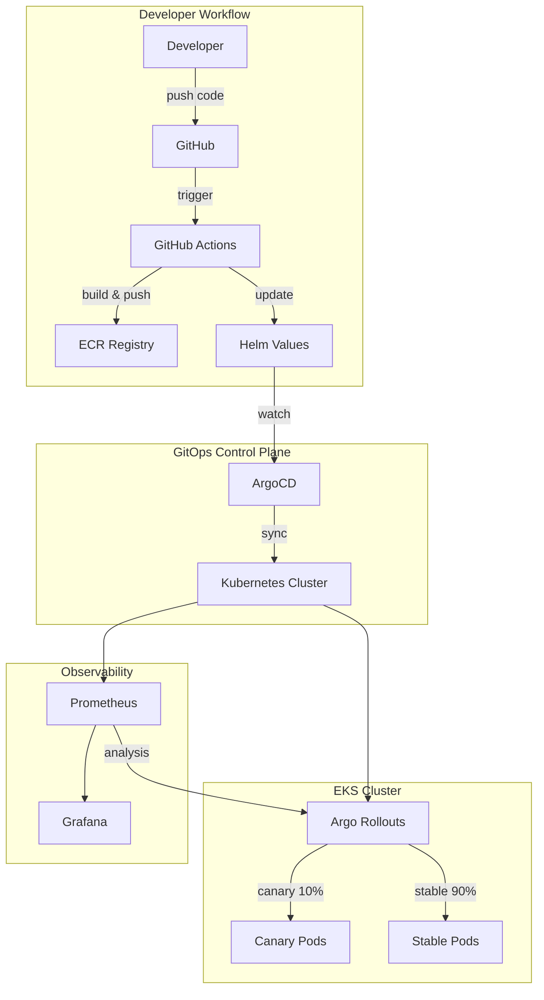

# GitOps Infrastructure Demo

[](https://terraform.io)
[](https://kubernetes.io)
[](https://argoproj.github.io/cd)
[](https://argoproj.github.io/rollouts)
[](LICENSE)

Production-ready GitOps reference architecture demonstrating modern Kubernetes deployment patterns with progressive delivery, policy enforcement, and observability.

## 🏗️ Architecture



[Full architecture documentation →](docs/architecture.md)

## ✨ What This Demonstrates

| Capability | Implementation | Location |
|------------|----------------|----------|
| **GitOps Workflow** | ArgoCD with App of Apps pattern | `argocd/` |
| **Progressive Delivery** | Argo Rollouts with canary analysis | `rollouts/` |
| **Infrastructure as Code** | Terraform modules for EKS | `terraform/` |
| **Policy as Code** | Kyverno admission policies | `policies/` |
| **Observability** | Prometheus, Grafana, AlertManager | `observability/` |
| **Secret Management** | External Secrets Operator + AWS SM | `secrets/` |
| **Multi-Environment** | Dev → Staging → Prod promotion | `argocd/applicationsets/` |

## 📂 Repository Structure

```
├── terraform/                 # Infrastructure provisioning
│   ├── modules/
│   │   ├── eks/              # EKS cluster module
│   │   ├── vpc/              # VPC networking
│   │   └── argocd/           # ArgoCD bootstrap
│   └── environments/
│       └── dev/              # Environment configs
├── argocd/                   # ArgoCD application definitions
│   ├── apps/                 # Application manifests
│   ├── projects/             # ArgoCD projects (RBAC)
│   └── applicationsets/      # Dynamic multi-env generation
├── helm/                     # Helm charts
│   └── sample-app/           # Example application chart
├── rollouts/                 # Argo Rollouts strategies
│   └── canary-strategy.yaml  # Canary with Prometheus analysis
├── policies/                 # Kyverno policies
│   └── kyverno/              # Security & best practice policies
├── observability/            # Monitoring stack
│   └── prometheus/           # Prometheus, Grafana, alerts
├── secrets/                  # External Secrets configuration
├── docs/                     # Documentation
│   ├── architecture.md       # System architecture
│   └── adr/                  # Architecture Decision Records
└── .github/
    └── workflows/            # CI/CD pipelines
```

## 🚀 Quick Start

### Prerequisites

- AWS CLI configured with appropriate credentials
- Terraform >= 1.6
- kubectl >= 1.28
- Helm >= 3.13

### 1. Provision Infrastructure

```bash
cd terraform/environments/dev
terraform init
terraform plan
terraform apply
```

### 2. Configure kubectl

```bash
aws eks update-kubeconfig --name gitops-demo-dev --region us-west-2
```

### 3. Access ArgoCD

```bash
# Get initial admin password
kubectl -n argocd get secret argocd-initial-admin-secret -o jsonpath="{.data.password}" | base64 -d

# Port forward
kubectl port-forward svc/argocd-server -n argocd 8080:443
```

## 🔄 Progressive Delivery

This repo demonstrates **canary deployments** with automated analysis:

```yaml
strategy:
  canary:
    steps:
    - setWeight: 10          # 10% traffic to canary
    - pause: {duration: 2m}
    - analysis:              # Check error rate via Prometheus
        templates:
        - templateName: success-rate
    - setWeight: 50          # Promote to 50%
    - setWeight: 100         # Full rollout
```

**Automatic rollback** triggers when:
- Error rate > 1%
- P99 latency > 500ms
- Pod restarts detected

[See full rollout configuration →](rollouts/canary-strategy.yaml)

## 🛡️ Policy Enforcement

Kyverno policies enforce security and best practices:

| Policy | Enforcement | Description |
|--------|-------------|-------------|
| `require-labels` | Enforce | Standard labels for all workloads |
| `require-resource-limits` | Enforce | CPU/memory limits required |
| `disallow-privileged` | Enforce | No privileged containers |
| `require-probes` | Audit | Liveness/readiness probes |

[See all policies →](policies/kyverno/)

## 📊 Observability

Pre-configured alerting for GitOps workflows:

- **ArgoCD App Out of Sync** (>15 min)
- **ArgoCD App Health Degraded**
- **Rollout Stalled** (>30 min)
- **High Error Rate** (>1%)
- **High Latency** (P99 > 500ms)

[See alerting rules →](observability/prometheus/alerts.yaml)

## 📚 Architecture Decision Records

Key decisions documented:

- [ADR-001: Why ArgoCD for GitOps](docs/adr/001-gitops-argocd.md)
- [ADR-002: Progressive Delivery with Argo Rollouts](docs/adr/002-progressive-delivery.md)
- [ADR-003: External Secrets Operator for Secrets](docs/adr/003-secret-management.md)

## 🔐 Security Features

- **RBAC**: Fine-grained access control for ArgoCD projects
- **Network Policies**: Namespace isolation and traffic control
- **External Secrets**: AWS Secrets Manager integration (no secrets in Git)
- **Kyverno Policies**: Admission control for security standards
- **Image Scanning**: Trivy integration in CI pipeline

## Author

**Thomas Vincent** — Senior DevOps Engineer

- GitHub: [@thomasvincent](https://github.com/thomasvincent)
- LinkedIn: [thomasvincent](https://linkedin.com/in/thomasvincent)
- Email: thomasvincent@gmail.com

## License

MIT License - see [LICENSE](LICENSE) for details.
