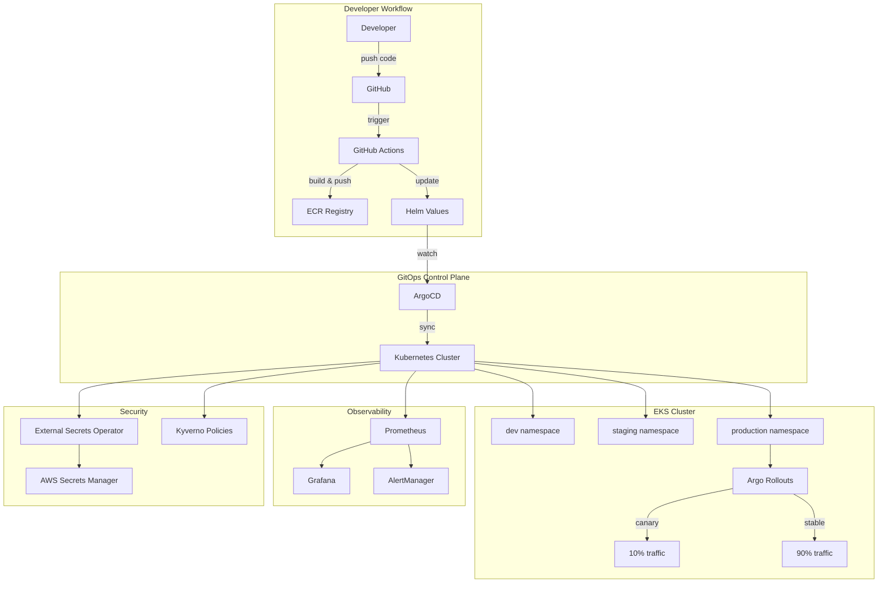
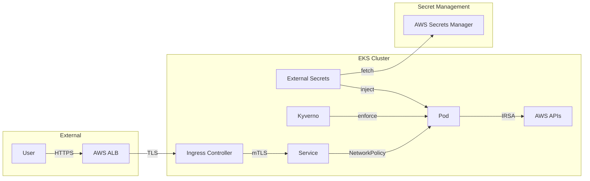

# Architecture Overview

## System Architecture

## Component Overview

### Infrastructure Layer (Terraform)

| Component | Purpose | Module |
|-----------|---------|--------|
| VPC | Network isolation with public/private subnets | `terraform/modules/vpc` |
| EKS | Managed Kubernetes control plane | `terraform/modules/eks` |
| ArgoCD | GitOps controller bootstrap | `terraform/modules/argocd` |

### GitOps Layer (ArgoCD)

| Component | Purpose | Location |
|-----------|---------|----------|
| App of Apps | Root application managing all others | `argocd/apps/` |
| ApplicationSets | Dynamic multi-environment generation | `argocd/applicationsets/` |
| Projects | RBAC and resource boundaries | `argocd/projects/` |

### Application Layer (Helm)

| Component | Purpose | Location |
|-----------|---------|----------|
| Sample App | Reference application with best practices | `helm/sample-app/` |

## Data Flow

1. **Code Change**: Developer pushes to feature branch
2. **CI Pipeline**: GitHub Actions builds, tests, scans, pushes image
3. **Image Promotion**: CI updates Helm values with new image tag
4. **GitOps Sync**: ArgoCD detects drift, syncs to cluster
5. **Progressive Rollout**: Argo Rollouts manages canary deployment
6. **Validation**: Prometheus metrics validate deployment health
7. **Promotion/Rollback**: Automatic promotion or rollback based on metrics

## Security Architecture

## Disaster Recovery

| Scenario | RTO | RPO | Strategy |
|----------|-----|-----|----------|
| Pod failure | < 1 min | 0 | Kubernetes self-healing |
| Node failure | < 5 min | 0 | Cluster Autoscaler + PodDisruptionBudgets |
| AZ failure | < 10 min | 0 | Multi-AZ deployment |
| Region failure | < 1 hour | < 5 min | GitOps replay to DR cluster |
| Cluster corruption | < 30 min | < 5 min | Velero backup restore |

## Cost Optimization

- **Karpenter**: Right-sized nodes based on pod requirements
- **Spot Instances**: Non-production workloads on spot
- **Resource Quotas**: Prevent runaway resource consumption
- **HPA**: Scale down during low traffic periods
